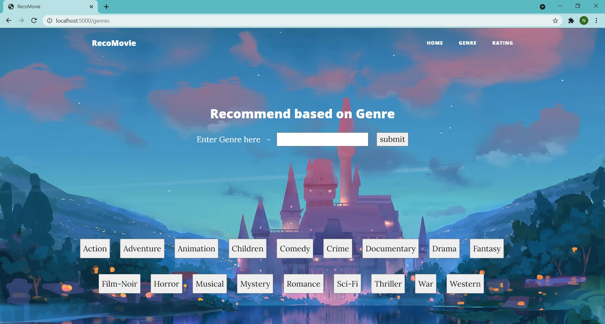

## Movie Recommendation System (Website) based on Genre
Movie Recommendation System created using Collaborative Filtering (Website) based on Genres

### Objectives

  1. To create a movie recommendation system using Collaborative Filtering and machine learning algorithms such as K Nearest Neighbours. 
  2. The system should recommend Top 10 movies based on the genre entered by the user.

### Dataset can be accessed from [here](https://grouplens.org/datasets/movielens/). 
  For redcuing the deployment time, data exploration followed by feature selection is done on the complete dataset.

### Website Implementation
<div align='center'>

</div>
<div align='center'>


</div>

### Steps of Code Execution

  1. Clone this [repository](https://github.com/nikita9604/Movie-Recommendation-Website-based-on-Genre)
  2. Unzip the downloaded folder
  3. In cmd, trace to the path of the folder
  4. Type ``` python project.py ``` to execute the program on the link provided.

### References
For more aditionally features and advance implementation of a Movie Recommendation System, visit [here](https://github.com/nikita9604/Movie-Recommendation-Website).
